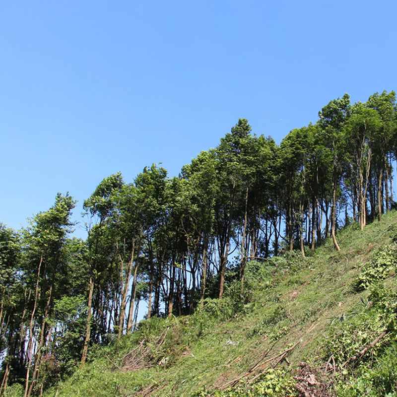
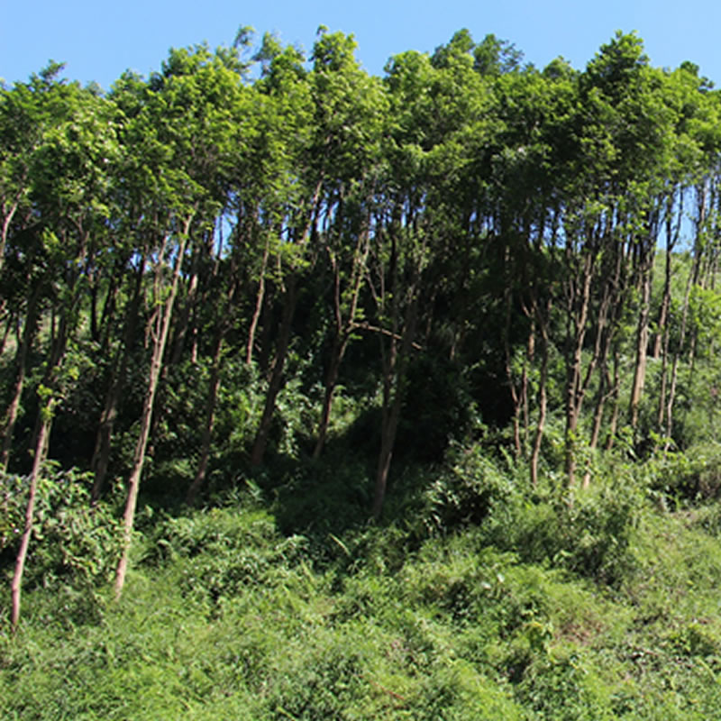
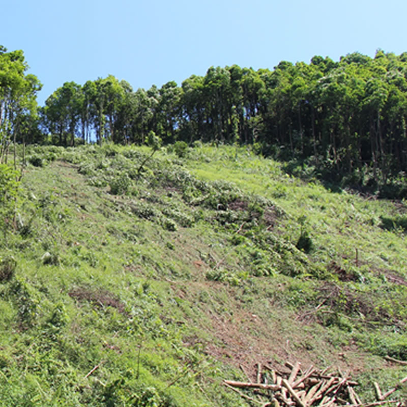
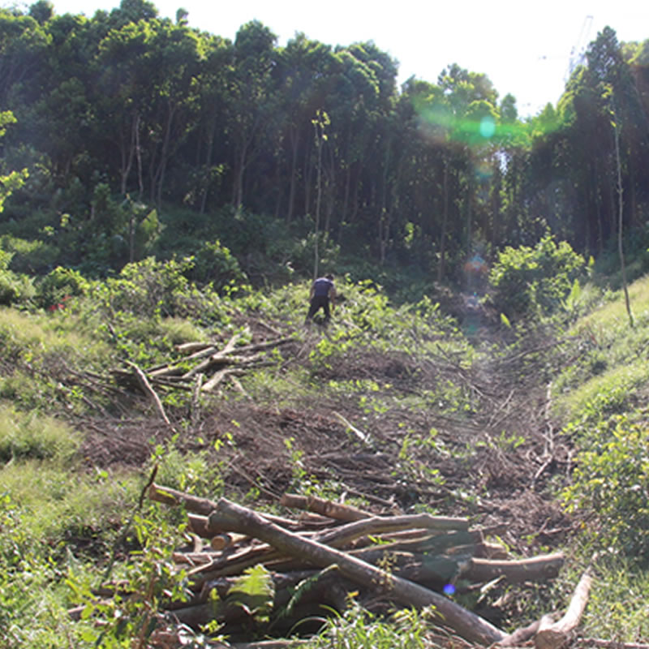
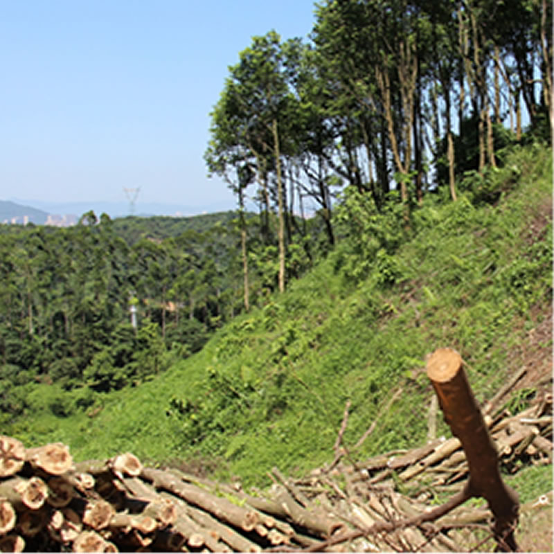
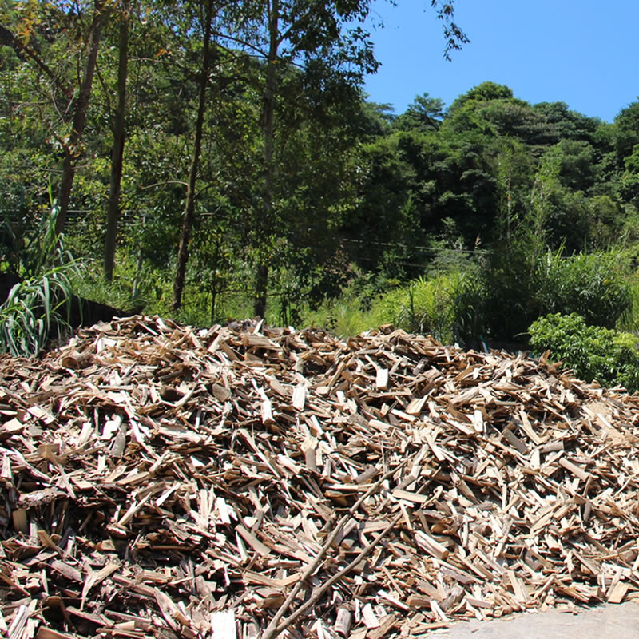
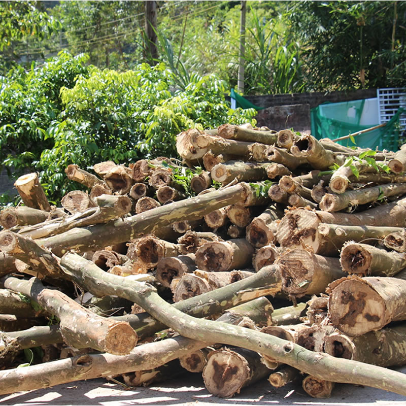
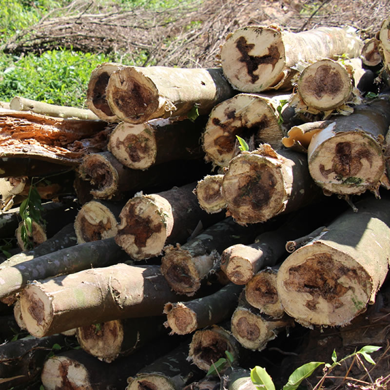
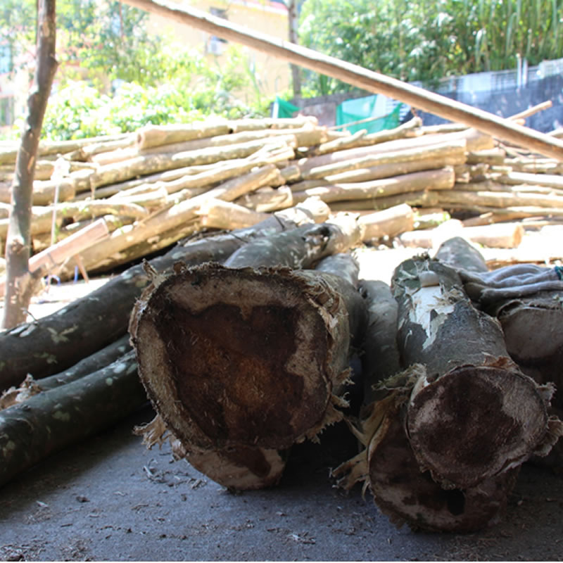

---

layout: page-fullwidth
title : "Plantation"
meta_title : "Plantation"
# subheadline : "Contact Form"
teaser : "我们在中国种植了上千亩的沉香树木"

permalink : "/plantation/"

# image:
#    thumb: "unsplash_brooklyn-bridge-thumb.jpg"

---
<!--more-->
---
teaser : "我们在中国种植了上千亩的沉香树木"

---

    

        
    

    

        
    

    

        
    

    

        
    

    

        
    

    

        
    

    

        
    

    

        
    

    

        
    

    

        
    

