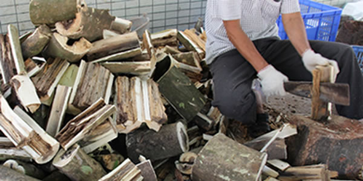

---

layout: page-fullwidth
title : "Producing"
meta_title : "Producing"
# subheadline : "Contact Form"
teaser : "我们在中国种植了上千亩的沉香树木"

permalink : "/producing/"

---
<!--more-->
---
teaser : "我们在中国种植了上千亩的沉香树木"

---

    

        
    

    

        
    

    

        
    

    

        
    

    

        
    

    

        
    

    

        
    

    

        
    

    

        
    

    

        
    

    

        
    

    

        
    

    

        
    

    

        
    

    

        
    

